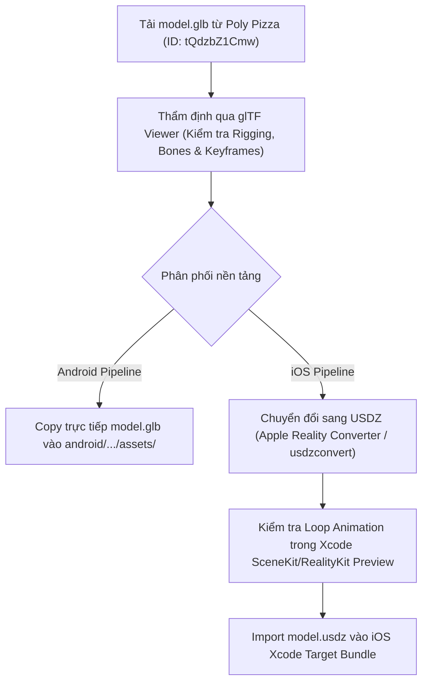

# AR Animation Project (iOS & Android Native)

[](https://github.com/)
[](https://developer.apple.com/swift/)
[](https://kotlinlang.org/)
[](https://developer.apple.com/augmented-reality/realitykit/)
[](https://developers.google.com/ar)
[](LICENSE)

Dự án Monorepo chuẩn kiến trúc cấp độ Production, quản lý hai ứng dụng Augmented Reality (AR) Native độc lập trên **iOS** và **Android**. Cả hai ứng dụng được thiết kế song song nhằm hiển thị cùng một mô hình 3D động (Skeletal Animation) được tối ưu hóa từ kho tài nguyên mã nguồn mở Poly Pizza.

---

## Mục lục (Table of Contents)
- [1. Giới thiệu dự án (Project Overview)](#1-giới-thiệu-dự-án-project-overview)
- [2. Cấu trúc thư mục (Monorepo Directory Structure)](#2-cấu-trúc-thư-mục-monorepo-directory-structure)
- [3. Công nghệ và Thư viện (Tech Stack & Specifications)](#3-công-nghệ-và-thư-viện-tech-stack--specifications)
- [4. Quy trình xử lý tài nguyên 3D (3D Asset Pipeline)](#4-quy-trình-xử-lý-tài-nguyên-3d-3d-asset-pipeline)
- [5. Tính năng chính & Luồng người dùng (User Flow)](#5-tính-năng-chính--luồng-người-dùng-user-flow)
- [6. Hướng dẫn cài đặt và Build môi trường (Setup & Build Guide)](#6-hướng-dẫn-cài-đặt-và-build-môi-trường-setup--build-guide)
- [7. Quy chuẩn Git Workflow & Commit Rules](#7-quy-chuẩn-git-workflow--commit-rules)

---

## 1. Giới thiệu dự án (Project Overview)

- **Tên dự án:** `ar-animation-project` (Mobile AR Native Multi-Platform).
- **Mục tiêu kỹ thuật:**
  - Triển khai trải nghiệm AR mượt mà, độ trễ thấp (low latency) trên cả 2 nền tảng Native OS.
  - Tự động nhận diện bề mặt phẳng nằm ngang/thẳng đứng thực tế (**Plane Detection**).
  - Định vị và neo giữ vật thể ổn định trong không gian vật lý (**World Tracking & Anchoring**).
  - Tương tác chạm để đặt vật thể (**Tap to Place**), hiển thị Reticle/Focus Indicator trực quan.
  - Tự động kích hoạt hoạt ảnh khung xương tích hợp sẵn (**Skeletal Animation Playback & Loop**).
  - Hỗ trợ thao tác tương tác tự nhiên: **Pinch to Scale** (phóng to/thu nhỏ) và **Two-Finger Rotation** (xoay quanh trục Y).
- **Tài nguyên 3D gốc:** [Poly Pizza Model (ID: `tQdzbZ1Cmw`)](https://poly.pizza/m/tQdzbZ1Cmw). Mô hình cung cấp dạng lưới 3D kèm hệ thống xương (Rigging) và hoạt cảnh định sẵn (Keyframe Animation).

---

## 2. Cấu trúc thư mục (Monorepo Directory Structure)

Dự án được tổ chức theo mô hình **Monorepo** phân tách rõ ràng giữa mã nguồn native và tài nguyên 3D chia sẻ dùng chung:

```bash
ar-animation-project/
├── .gitignore                      # Git ignore dùng chung cho toàn bộ workspace
├── README.md                       # Tài liệu kỹ thuật chi tiết của dự án
├── shared-assets/                  # Kho lưu trữ tài nguyên 3D gốc và phái sinh
│   ├── raw/                        # File model 3D gốc tải về từ nguồn
│   │   └── model.glb               # Định dạng chuẩn GLTF/GLB (Poly Pizza ID: tQdzbZ1Cmw)
│   ├── converted/                  # File thành phẩm sau khi chuyển đổi định dạng
│   │   └── model.usdz              # Định dạng USDZ dành riêng cho Apple RealityKit/QuickLook
│   └── textures/                   # Textures/Materials trích xuất (nếu cần xử lý thêm)
│
├── ios/                            # Dự án Native iOS (Xcode Workspace / Project)
│   ├── ARAnimationApp/
│   │   ├── App/                    # Điểm khởi chạy ứng dụng (App Lifecycle)
│   │   │   └── ARAnimationApp.swift
│   │   ├── Views/                  # UI SwiftUI và AR Container View
│   │   │   ├── ContentView.swift
│   │   │   └── ARViewContainer.swift
│   │   ├── ViewModels/             # Quản lý trạng thái AR, Gestures, Reticle Focus
│   │   │   └── ARViewModel.swift
│   │   ├── Resources/              # Bundle resources và 3D Model cho Xcode target
│   │   │   └── model.usdz
│   │   └── Supporting Files/       # Info.plist cấu hình NSCameraUsageDescription
│   │       └── Info.plist
│   └── ARAnimationApp.xcodeproj
│
└── android/                        # Dự án Native Android (Gradle Project)
    ├── build.gradle.kts            # Cấu hình Gradle cấp Project
    ├── settings.gradle.kts         # Khai báo modules
    └── app/
        ├── build.gradle.kts        # Cấu hình Gradle cấp Module (Dependencies ARCore/Sceneview)
        └── src/
            └── main/
                ├── AndroidManifest.xml   # Khai báo quyền Camera và ARCore metadata
                ├── assets/         # Tài nguyên tĩnh đóng gói vào APK
                │   └── model.glb   # File 3D GLB nạp trực tiếp qua Sceneview/Filament
                ├── java/com/example/aranimation/
                │   ├── MainActivity.kt   # UI điều khiển (Jetpack Compose hoặc ViewBinding)
                │   ├── ARScreen.kt       # Khung nhìn ARScene, Plane Renderer & Gesture Handling
                │   └── ARViewModel.kt    # Logic xử lý trạng thái phát hiện mặt phẳng
                └── res/            # Layouts, icons, themes, strings
```

---

## 3. Công nghệ và Thư viện (Tech Stack & Specifications)

### Bảng so sánh thông số kỹ thuật (Technical Matrix)

| Tiêu chí | Nền tảng iOS | Nền tảng Android |
| :--- | :--- | :--- |
| **Ngôn ngữ (Language)** | Swift 5.9+ | Kotlin 1.9+ |
| **Giao diện (UI Framework)** | SwiftUI + UIKit (UIViewRepresentable) | Jetpack Compose (hoặc XML Views) |
| **AR Core Engine** | ARKit 6+ | Google ARCore 1.40+ |
| **Rendering Engine** | RealityKit 3 / 4 | Sceneview Android (Google Filament PBR Engine) |
| **Định dạng 3D (Asset Format)** | `.usdz` (Universal Scene Description Zipped) | `.glb` (glTF 2.0 Binary) |
| **Hệ thống Animation** | RealityKit `Entity.playAnimation(repeatCount:)` | Filament / Sceneview Animation Mixer API |
| **Yêu cầu phần cứng tối thiểu** | Chip Apple A12 Bionic trở lên | Thiết bị có chứng nhận ARCore (ARCore Supported Devices) |
| **Hệ điều hành tối thiểu** | iOS 16.0+ | Android 7.0+ (API Level 24 / Khuyến nghị API 26+) |
| **Quyền truy cập (Permissions)** | `NSCameraUsageDescription` | `android.permission.CAMERA` |

### Chi tiết cấu hình quyền (Permissions Configuration)

#### iOS (`Info.plist`)
```xml
<key>NSCameraUsageDescription</key>
<string>Ứng dụng cần quyền truy cập Camera để quét bề mặt và định vị vật thể AR trong không gian thực.</string>
```

#### Android (`AndroidManifest.xml`)
```xml
<!-- Khai báo quyền sử dụng Camera -->
<uses-permission android:name="android.permission.CAMERA" />

<!-- Khai báo bắt buộc hỗ trợ AR (AR Required) hoặc tùy chọn (AR Optional) -->
<uses-feature android:name="android.hardware.camera.ar" android:required="true" />
<uses-feature android:glEsVersion="0x00030000" android:required="true" />

<application>
    <!-- Đánh dấu ứng dụng yêu cầu Google Play Services for AR -->
    <meta-data
        android:name="com.google.ar.core"
        android:value="required" />
</application>
```

---

## 4. Quy trình xử lý tài nguyên 3D (3D Asset Pipeline)

Quy trình nhập, thẩm định và chuẩn hóa mô hình 3D đảm bảo tính tương thích đồng nhất giữa 2 rendering engine:



### Bước 1: Thu thập tài nguyên gốc
1. Truy cập liên kết: [https://poly.pizza/m/tQdzbZ1Cmw](https://poly.pizza/m/tQdzbZ1Cmw).
2. Nhấn **Download** và chọn định dạng file `.glb`.
3. Lưu file vào thư mục `shared-assets/raw/model.glb`.

### Bước 2: Kiểm tra Animation & Tọa độ trước khi tích hợp
Trước khi nhúng vào dự án, cần đảm bảo file 3D không bị lỗi lệch tâm (origin point), tỉ lệ kích thước (scale quá to hoặc quá bé) hoặc hỏng animation:
1. Mở trình duyệt và truy cập: [https://gltf-viewer.donmccurdy.com/](https://gltf-viewer.donmccurdy.com/).
2. Kéo thả file `model.glb` vào cửa sổ xem.
3. Kiểm tra các yếu tố kỹ thuật:
   - **Animation Controller:** Bật thanh Play/Pause để xác nhận animation xương (Skeletal Rigging) hoạt động mượt mà.
   - **Bounding Box & Scale:** Đảm bảo kích thước vật thể chuẩn theo đơn vị mét ($1\text{ unit} = 1\text{ meter}$).
   - **Materials / PBR:** Kiểm tra độ phản chiếu, màu sắc Base Color và Roughness.

### Bước 3: Pipeline chuyển đổi và đóng gói

#### Dành cho Android:
- Không cần chuyển đổi định dạng. Google Filament và Sceneview hỗ trợ gốc glTF/GLB 2.0.
- Sao chép file:
  ```bash
  cp shared-assets/raw/model.glb android/app/src/main/assets/model.glb
  ```

#### Dành cho iOS:
RealityKit yêu cầu định dạng `.usdz` để nạp trực tiếp `ModelEntity` và tối ưu hoá bộ nhớ:
- **Cách 1 (Sử dụng GUI - Khuyến nghị):**
  1. Tải và mở ứng dụng **Reality Converter** của Apple (yêu cầu macOS).
  2. Kéo thả file `model.glb` vào giao diện.
  3. Kiểm tra Animation tab để xác nhận track animation được bảo toàn đầy đủ.
  4. Chọn **File -> Export...** và lưu thành `shared-assets/converted/model.usdz`.
- **Cách 2 (Sử dụng Apple Command Line Tools):**
  ```bash
  usdzconvert shared-assets/raw/model.glb shared-assets/converted/model.usdz
  ```
- **Tích hợp vào Xcode:** Kéo file `shared-assets/converted/model.usdz` vào nhóm `Resources` của project iOS và tích chọn **Copy items if needed** cũng như gán vào target `ARAnimationApp`.

---

## 5. Tính năng chính & Luồng người dùng (User Flow)

Trải nghiệm người dùng được thiết kế chuẩn mực theo Human Interface Guidelines (Apple) và AR Design Guidelines (Google):

```
+------------------+     Camera Permission     +------------------------+
| 1. Khởi chạy App | ------------------------> | 2. Quét không gian     |
|                  |     Được chấp thuận       |    (Plane Detection)   |
+------------------+                           +------------------------+
                                                           |
                                                           | Phát hiện mặt phẳng
                                                           v
+------------------+         Pinch / Rotate    +------------------------+
| 4. Thao tác cử   | <------------------------ | 3. Chạm để đặt vật thể |
|    chỉ tương tác |     Tự động chạy Loop     |    (Tap to Place)      |
+------------------+     Animation             +------------------------+
```

### Chi tiết các trạng thái:
1. **Khởi tạo và Cấp quyền:**
   - Ứng dụng khởi động kiểm tra trạng thái camera. Nếu chưa cấp quyền, hiển thị dialog giải thích lý do cần thiết và yêu cầu cấp quyền.
2. **Khảo sát bề mặt (Plane Hunting & Surface Detection):**
   - Động cơ AR (ARKit/ARCore) bắt đầu giải thuật VIO (Visual-Inertial Odometry) và Feature Points Tracking.
   - Khi phát hiện mặt phẳng nằm ngang khả dụng, một con trỏ định vị (**Focus Reticle / Indicator Ring**) sẽ bám theo bề mặt vật lý theo thời gian thực (thông qua Raycasting).
3. **Neo giữ và Tạo vật thể (Anchoring & Placement):**
   - Người dùng thực hiện thao tác **Tap** vào màn hình.
   - Hệ thống thực hiện hit-test (`raycastQuery`), lấy tọa độ điểm giao cắt thực tế, sinh ra một `Anchor` cố định vào không gian.
   - Mô hình 3D được instantiate tại điểm neo và bắt đầu phát vòng lặp hoạt họa không ngừng (`RepeatCount: infinity`).
4. **Tương tác cử chỉ (Gesture Manipulation):**
   - **Pinch-to-scale:** Điều chỉnh tỉ lệ mô hình (giới hạn từ $0.2\times$ đến $3.0\times$ để tránh tràn bộ nhớ hoặc biến dạng tầm nhìn).
   - **Two-finger rotation:** Xoay vật thể mượt mà quanh trục thẳng đứng ($Y$-axis).

---

## 6. Hướng dẫn cài đặt và Build môi trường (Setup & Build Guide)

> [!IMPORTANT]
> **Lưu ý phần cứng bắt buộc:** Tính năng Augmented Reality tương tác với cảm biến gia tốc, con quay hồi chuyển và camera thực. **Không thể giả lập đầy đủ trên iOS Simulator hoặc Android Studio Emulator thông thường**. Bắt buộc phải thử nghiệm trực tiếp trên **thiết bị di động thật (Real Physical Device)**.

### Yêu cầu môi trường phát triển (Prerequisites)
- **Hệ điều hành:** macOS Sonoma hoặc mới nhất (khuyến nghị để build được cả 2 nền tảng).
- **iOS Toolchain:**
  - Xcode 15.0+ (kèm command line tools).
  - Apple Developer Account (tài khoản cá nhân miễn phí hoặc trả phí) để ký chứng chỉ provisioning profile.
- **Android Toolchain:**
  - Android Studio Hedgehog (2023.1.1) hoặc mới hơn.
  - Java Development Kit: JDK 17 (LTS).
  - Cáp kết nối chuẩn Type-C / Lightning và bật chế độ **USB Debugging** (Android) hoặc **Developer Mode** (iOS 16+).

---

### Hướng dẫn triển khai iOS (Xcode)

1. **Điều hướng vào thư mục iOS:**
   ```bash
   cd ios
   open ARAnimationApp.xcodeproj
   ```
2. **Cấu hình Signing & Capabilities:**
   - Chọn project `ARAnimationApp` ở cây thư mục bên trái -> chọn target `ARAnimationApp`.
   - Chuyển sang tab **Signing & Capabilities**.
   - Tại mục **Team**, chọn Apple Team cá nhân của bạn.
   - Thay đổi **Bundle Identifier** thành định dạng duy nhất (ví dụ: `com.yourcompany.aranimation`).
3. **Kết nối thiết bị & Cài đặt:**
   - Cắm iPhone/iPad hỗ trợ ARKit vào máy Mac.
   - Trên điện thoại: Bật `Cài đặt > Quyền riêng tư & Bảo mật > Chế độ nhà phát triển (Developer Mode) > Bật`.
   - Trên Xcode: Chọn thiết bị thật ở thanh target bar trên cùng.
   - Nhấn tổ hợp phím `Cmd + R` để biên dịch và chạy ứng dụng.

---

### Hướng dẫn triển khai Android (Android Studio)

1. **Mở dự án:**
   - Khởi chạy Android Studio, chọn **Open**, trỏ tới thư mục `ar-animation-project/android`.
   - Chờ hệ thống đồng bộ hóa Gradle (`Sync Project with Gradle Files`).
2. **Cấu hình Package Name & Thư viện:**
   - Mở file `app/build.gradle.kts` xác nhận namespace và applicationId (ví dụ: `com.example.aranimation`).
   - Đảm bảo đã khai báo phụ thuộc Sceneview:
     ```kotlin
     dependencies {
         implementation("io.github.sceneview:arsceneview:2.2.1")
     }
     ```
3. **Kết nối thiết bị & Cài đặt:**
   - Bật **Developer Options** và kích hoạt **USB Debugging** trên thiết bị Android.
   - Cài đặt sẵn ứng dụng [Google Play Services for AR](https://play.google.com/store/apps/details?id=com.google.ar.core) từ Google Play Store.
   - Chọn thiết bị thật trong danh sách Deployment Target của Android Studio.
   - Nhấn nút **Run 'app'** (`Shift + F10`) để build và cài đặt file APK.

---

## 7. Quy chuẩn Git Workflow & Commit Rules

Dự án tuân thủ nghiêm ngặt mô hình rẽ nhánh chuẩn và quy ước viết commit để đảm bảo tính minh bạch khi phối hợp nhiều thành viên:

### Quy tắc phân nhánh (Branching Strategy)
- `main`: Nhánh ổn định (Production-ready). Chỉ nhận mã nguồn thông qua Pull Request (PR) đã được review kỹ lưỡng.
- `feature/ios-ar`: Nhánh phát triển tính năng, kiến trúc AR và giao diện trên nền tảng iOS.
- `feature/android-ar`: Nhánh phát triển tính năng, kiến trúc AR và giao diện trên nền tảng Android.
- `chore/shared-assets`: Nhánh cập nhật, bổ sung hoặc tối ưu hóa mô hình 3D và shaders.

```
       (feature/ios-ar)     o---o---o
                           /         \  (Pull Request)
main  o-------------------o-----------o------------------>
                           \         /  (Pull Request)
     (feature/android-ar)   o---o---o
```

### Quy chuẩn Conventional Commits
Mọi commit message bắt buộc tuân theo format:
```text
<type>(<scope>): <mô tả ngắn gọn bằng tiếng Anh hoặc tiếng Việt>

[Tùy chọn: Mô tả chi tiết lý do và thay đổi kỹ thuật]
```

#### Các tiền tố `<type>` được chấp nhận:
- `feat`: Tính năng mới (ví dụ: `feat(ios): implement realitykit tap to place gesture`).
- `fix`: Sửa lỗi phát sinh (ví dụ: `fix(android): resolve memory leak when reloading filament scene`).
- `chore`: Thay đổi cấu hình build, cập nhật file model 3D hoặc tài liệu (ví dụ: `chore(assets): optimize polygon count for model.glb`).
- `refactor`: Tái cấu trúc mã nguồn không thay đổi logic nghiệp vụ (ví dụ: `refactor(ios): decouple ar viewmodel from swiftui container`).
- `docs`: Cập nhật tài liệu kỹ thuật, bổ sung README (ví dụ: `docs: update setup and build guide for android`).

---

## Bản quyền & Ghi công (License & Credits)
- 3D Model: [Poly Pizza](https://poly.pizza/) (Mã tài sản: `tQdzbZ1Cmw`). Sử dụng theo điều khoản cấp phép của tác giả gốc trên nền tảng.
- Toàn bộ mã nguồn phần mềm được phát hành theo giấy phép [MIT License](LICENSE).
